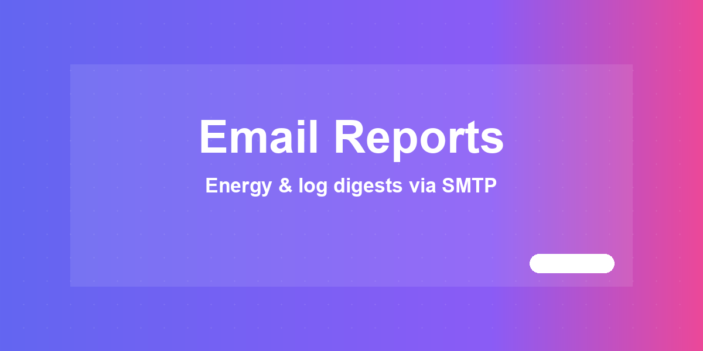
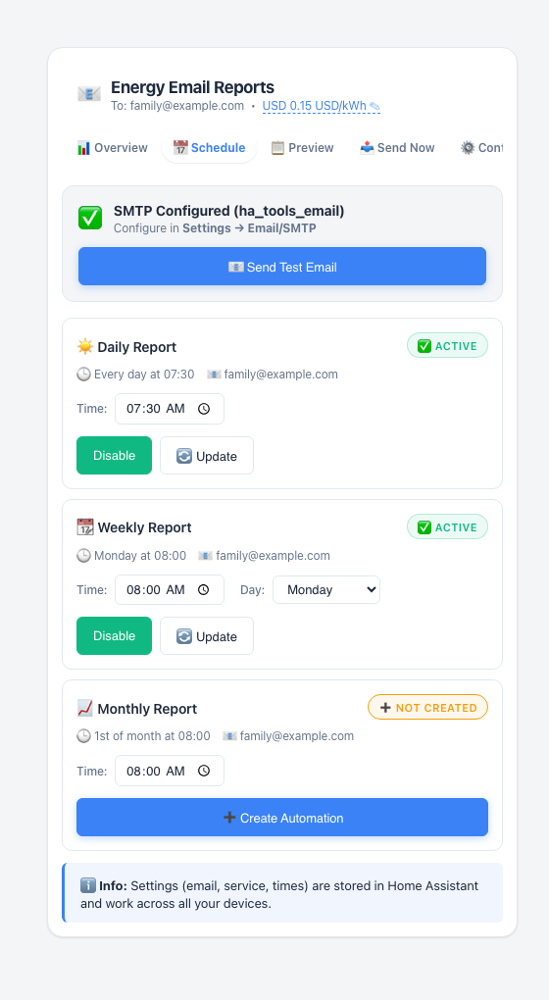
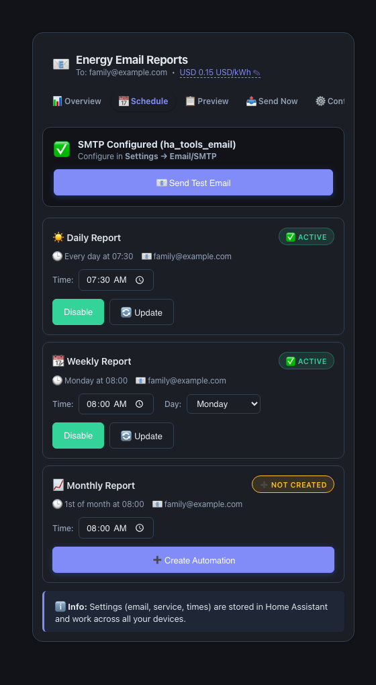

# 📧 HA Tools — Email & Reports



Three Lovelace cards in one HACS plugin: scheduled energy-usage emails,
error/warning log-digest emails, and a zero-config dashboard summary. The two
email cards send through the separate **HA Tools Email** integration; the
summary card needs nothing extra.

[](https://www.home-assistant.io/) [](https://github.com/MacSiem/ha-tools-email-reports/releases) [](LICENSE)

Part of the [HA Tools](https://github.com/MacSiem) ecosystem.

## How it works

This plugin ships one Lovelace resource (`ha-tools-email-reports.js`) — a
single-file bundle that contains all three cards (the individual
`ha-energy-email.js` / `ha-log-email.js` / `ha-smart-reports.js` files are
kept in the repo for development only). There is **no
`custom:ha-tools-email-reports` card type**; add the individual cards you
want by their own tag:

1. **`ha-energy-email`** — sends daily / weekly / monthly energy-usage
   reports by email. Energy sensors are auto-discovered (`device_class:
   energy`, or `kWh`/`Wh` with a `total_increasing`/`total`/`measurement`
   state class) and ranked by usage; cost is estimated from a configurable
   flat or day/night/weekday/weekend tariff.
2. **`ha-log-email`** — sends a daily digest of `system_log` errors and
   warnings (`system_log/list`), with a configurable entry limit and a
   history tab.
3. **`ha-smart-reports`** — a standalone dashboard summary (energy /
   automations / system-health tabs) computed entirely from current
   `hass.states`. It **does not** send email and does not need the
   integration below.

**`ha-energy-email` and `ha-log-email` require the separate [HA Tools
Email](https://github.com/MacSiem/ha-tools-email-integration) integration**
(`ha_tools_email` domain). Detection is a client-side check for
`hass.services.ha_tools_email.send`; if it's missing, the card shows an
inline "This tool requires the HA Tools Email integration" banner with an
install link instead of failing silently. Once the integration is installed
and SMTP is configured (once, in the integration's own settings), the cards
talk to it purely through HA services:

- `ha_tools_email.get_config` — reads the configured default recipient.
- `ha_tools_email.test` — sends a test email to verify SMTP.
- `ha_tools_email.send` — sends the actual report.

Scheduling does **not** rely on a browser tab staying open: clicking
"Create Automation" on the Schedule tab has the card write an ordinary Home
Assistant automation (e.g. `automation.send_daily_energy_report`) whose
action calls `ha_tools_email.send` with a Jinja-templated subject/body. HA's
own automation engine fires it, so it keeps working after the dashboard is
closed. The card only creates/updates/enables/disables that automation and
reflects its `on`/`off` state — the send itself happens server-side.

### What is automatic vs. manual

| Automatic | Manual (optional) |
|---|---|
| Energy/power sensor discovery (`ha-energy-email`, `ha-smart-reports`) | Setting SMTP server/recipient once, in the HA Tools Email integration |
| Integration-presence detection + install banner | Creating/enabling the daily / weekly / monthly report automations |
| Error/warning digest from `system_log` (`ha-log-email`) | Choosing send time, weekday, currency and tariff mode |
| Dashboard summary — energy / automations / system (`ha-smart-reports`) | Exporting the `ha-smart-reports` snapshot to CSV/JSON |

## Screenshots

| Light | Dark |
|---|---|
|  |  |

*`ha-energy-email`'s Schedule tab with the HA Tools Email integration
detected (SMTP-configured banner) and the daily and weekly report
automations already created and active. Dark mode follows your Home
Assistant theme automatically.*

## Installation

### HACS (custom repository)

1. Open HACS → Frontend (Dashboard) → ⋮ → **Custom repositories**.
2. Add `https://github.com/MacSiem/ha-tools-email-reports` with category
   **Dashboard** (Lovelace plugin).
3. Install **HA Tools — Email & Reports** and reload your browser. HACS
   delivers a single file (`ha-tools-email-reports.js`) that bundles all
   three cards — nothing else to download.
4. If you want `ha-energy-email` or `ha-log-email`, also add
   `https://github.com/MacSiem/ha-tools-email-integration` with category
   **Integration**, install it, and restart Home Assistant.
   `ha-smart-reports` works without this step.

### Manual

1. Download `ha-tools-email-reports.js` (the bundle with all three cards)
   from the [latest
   release](https://github.com/MacSiem/ha-tools-email-reports/releases).
2. Copy it to `/config/www/community/ha-tools-email-reports/`.
3. Add `/local/community/ha-tools-email-reports/ha-tools-email-reports.js`
   as a Lovelace resource (type: `module`).

## Quick start

```yaml
type: custom:ha-energy-email
```

The other two cards are added the same way:

```yaml
type: custom:ha-log-email
```

```yaml
type: custom:ha-smart-reports
```

All config keys are optional. A more complete `ha-energy-email` example:

```yaml
type: custom:ha-energy-email
title: Energy Email Reports
recipient: your@email.com      # optional — auto-detected from the integration's default recipient
currency: PLN
energy_price: 0.65
energy_tariff_mode: flat       # flat | day_night | weekday_weekend | mixed
```

## FAQ

**Do I have to configure anything?**
`ha-smart-reports` needs nothing. `ha-energy-email` and `ha-log-email` need
the HA Tools Email integration installed and its SMTP settings saved once —
after that, recipient auto-detection and "Send Now" work immediately.

**What happens if the HA Tools Email integration isn't installed?**
`ha-energy-email` and `ha-log-email` show an inline banner explaining the
integration is required and linking to it — they don't fail silently or send
through your `notify:` platform instead.

**Does scheduled sending require a browser tab to stay open?**
No. Creating a schedule writes a normal Home Assistant automation that calls
`ha_tools_email.send`; HA's automation engine runs it, not the card.

**Where do the emails actually go out through?**
Your own SMTP server, configured once in the HA Tools Email integration.
This plugin's cards never talk to any mail server directly — they only call
`ha_tools_email.send` / `.test` / `.get_config`.

**Does this send data anywhere else, or use any CDN?**
No. There are no `fetch`/`XMLHttpRequest` calls anywhere in this repo's
code — the only outbound URLs are the optional donate links (Buy Me a
Coffee / PayPal) and HACS install-guide links, which only open if you click
them. No telemetry, no analytics, no CDN-hosted assets (system fonts only).
The email cards do auto-inject one extra script, `ha-tools-discovery.js`
from [ha-tools-panel](https://github.com/MacSiem/ha-tools-panel), but only
from your own HA instance's same-origin `/local/community/ha-tools-panel/`
path — no external network request is ever made, and if that file isn't
installed the injection simply fails silently.

## Changelog

See [CHANGELOG.md](CHANGELOG.md).

## Support

If this tool makes your Home Assistant life easier, consider supporting
development:

- [☕ Buy Me a Coffee](https://buymeacoffee.com/macsiem)
- [💳 PayPal](https://www.paypal.com/donate/?hosted_button_id=Y967H4PLRBN8W)

## License

MIT — see [LICENSE](LICENSE).
