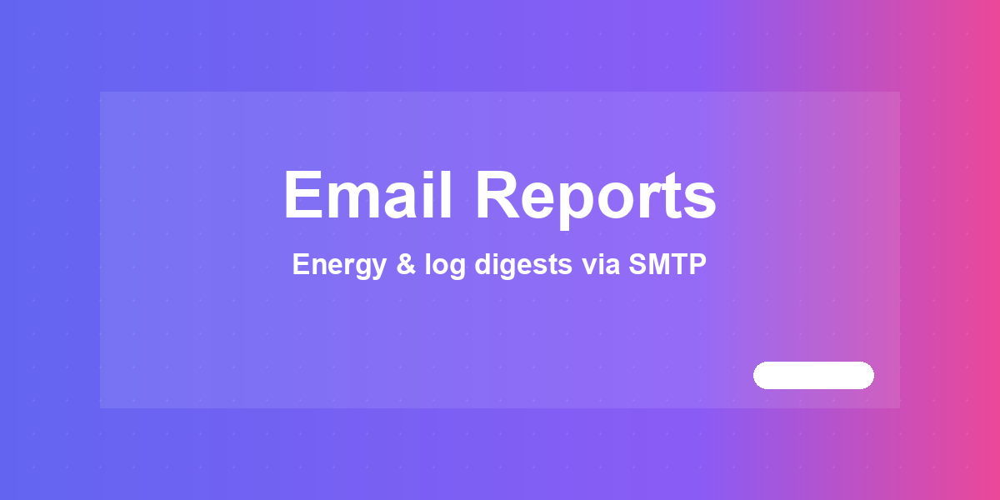
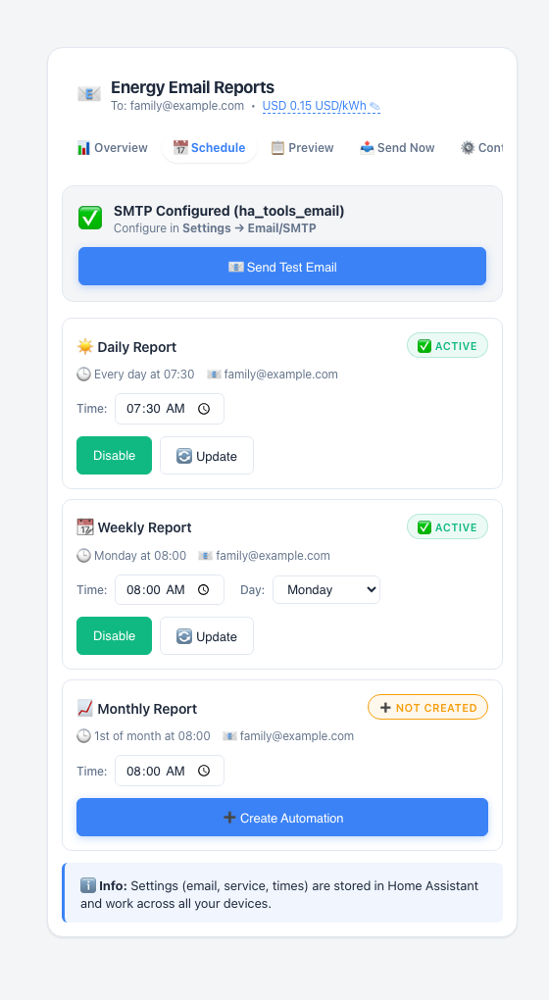
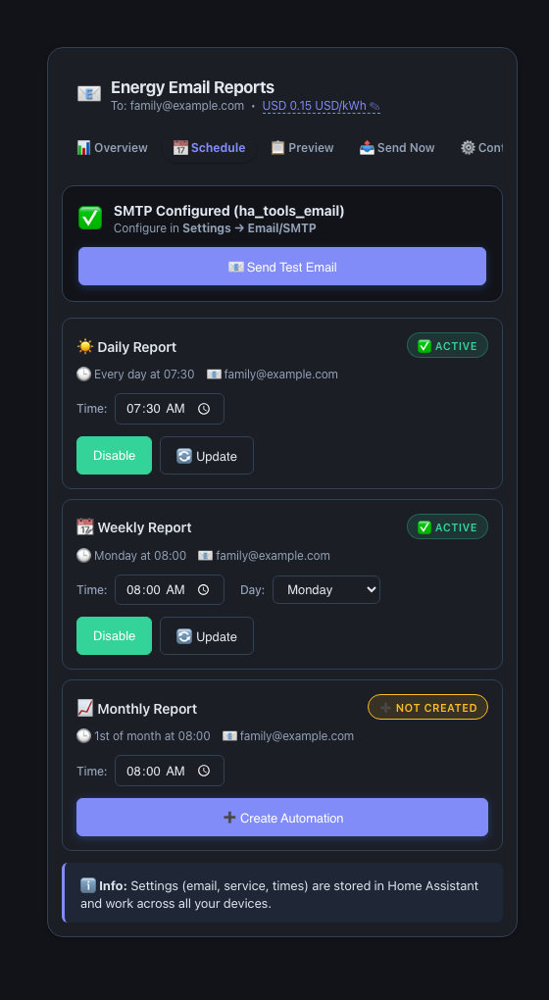

# 📧 HA Tools — Email & Reports



Error/warning log-digest emails and a Recorder-backed dashboard report in one
HACS plugin. The log card sends through the separate **HA Tools Email**
integration; Smart Reports reads Home Assistant Energy/Recorder data and does
not send email.

> **Energy Email moved to Energy Optimizer (4.5.0).** `custom:ha-energy-email`
> is now maintained in [Energy Optimizer](https://github.com/MacSiem/ha-energy-optimizer)
> (HACS default catalog). This plugin keeps a thin wrapper so existing cards
> keep working: with Energy Optimizer installed they render its card; without
> it they show how to install it. No dashboard changes are needed.

[](https://www.home-assistant.io/) [](https://github.com/MacSiem/ha-tools-email-reports/releases) [](LICENSE)

Part of the [HA Tools](https://github.com/MacSiem) ecosystem.

## How it works

This plugin ships one Lovelace resource (`ha-tools-email-reports.js`) — a
single-file bundle that contains the log and Smart Reports cards plus the
Energy Email wrapper (the individual
`ha-energy-email.js` / `ha-log-email.js` / `ha-smart-reports.js` files are
kept in the repo for development only). There is **no
`custom:ha-tools-email-reports` card type**; add the individual cards you
want by their own tag:

1. **`ha-energy-email`** — compatibility wrapper only. The card itself is
   provided by [Energy Optimizer](https://github.com/MacSiem/ha-energy-optimizer);
   install it from HACS to use energy-usage emails.
2. **`ha-log-email`** — sends a daily digest of `system_log` errors and
   warnings (`system_log/list`), with a configurable entry limit and a
   history tab.
3. **`ha-smart-reports`** — an on-demand energy / automations / system-health
   report. Energy periods use exact Recorder `change` statistics declared by
   Home Assistant Energy (or explicit statistic IDs); Automations and System
   remain current-state operational summaries. It **does not** send email and
   does not need the integration below.

**`ha-log-email` (and Energy Optimizer's `ha-energy-email`) require the separate [HA Tools
Email](https://github.com/MacSiem/ha-tools-email-integration) integration**
(`ha_tools_email` domain). Detection is a client-side check for
`hass.services.ha_tools_email.send`; if it's missing, the card shows an
inline "This tool requires the HA Tools Email integration" banner with an
install link instead of failing silently. Once the integration is installed
and SMTP is configured (once, in the integration's own settings), the cards
talk to it purely through HA services:

- `ha_tools_email.get_config` — reads the configured default recipient.
- `ha_tools_email.test` — sends a test email to verify SMTP.
- `ha_tools_email.send` — sends the actual report.

Scheduling does **not** rely on a browser tab staying open: clicking
"Create Automation" on the Schedule tab has the card write an ordinary Home
Assistant automation (e.g. `automation.send_daily_energy_report`) whose
action calls `ha_tools_email.send` with a Jinja-templated subject/body. HA's
own automation engine fires it, so it keeps working after the dashboard is
closed. The card only creates/updates/enables/disables that automation and
reflects its `on`/`off` state — the send itself happens server-side.

### What is automatic vs. manual

| Automatic | Manual (optional) |
|---|---|
| Home Assistant Energy source mapping (`ha-smart-reports`) | Setting SMTP server/recipient once, in the HA Tools Email integration |
| Integration-presence detection + install banner | Creating/enabling the daily / weekly / monthly report automations |
| Error/warning digest from `system_log` (`ha-log-email`) | Choosing send time, weekday, currency and tariff mode |
| Automation/system operational summary (`ha-smart-reports`) | Selecting explicit Smart Reports total/device/cost statistic roles |
| Recorder-backed local-calendar energy periods (`ha-smart-reports`) | Exporting Smart Reports schema-v2 JSON or flat CSV |

## Screenshots

| Light | Dark |
|---|---|
|  |  |

*The Energy Email Schedule tab (screenshot from before 4.5.0; the card now
lives in Energy Optimizer) with the HA Tools Email integration
detected (SMTP-configured banner) and the daily and weekly report
automations already created and active. Dark mode follows your Home
Assistant theme automatically.*

## Installation

### HACS (custom repository)

1. Open HACS → Frontend (Dashboard) → ⋮ → **Custom repositories**.
2. Add `https://github.com/MacSiem/ha-tools-email-reports` with category
   **Dashboard** (Lovelace plugin).
3. Install **HA Tools — Email & Reports** and reload your browser. HACS
   delivers a single file (`ha-tools-email-reports.js`) — nothing else to
   download. For `ha-energy-email`, also install **Energy Optimizer** from the
   HACS default catalog.
4. If you want `ha-log-email` (or Energy Optimizer's `ha-energy-email`), also add
   `https://github.com/MacSiem/ha-tools-email-integration` with category
   **Integration**, install it, and restart Home Assistant.
   `ha-smart-reports` works without this step.

### Manual

1. Download `ha-tools-email-reports.js` (the bundle)
   from the [latest
   release](https://github.com/MacSiem/ha-tools-email-reports/releases).
2. Copy it to `/config/www/community/ha-tools-email-reports/`.
3. Add `/local/community/ha-tools-email-reports/ha-tools-email-reports.js`
   as a Lovelace resource (type: `module`).

## Quick start

```yaml
type: custom:ha-log-email
```

Smart Reports is added the same way:

```yaml
type: custom:ha-smart-reports
```

The minimal Smart Reports configuration uses the Home Assistant Energy
Dashboard preferences. It does not auto-detect energy entities from names or
fall back to current entity states. If no grid import statistic is configured,
the card shows a configuration state.

Use explicit roles when the report should use a different exact set:

```yaml
type: custom:ha-smart-reports
energy_source_mode: explicit
energy_total_statistics:
  - sensor.grid_import_energy
energy_device_statistics:
  - statistic_id: sensor.heat_pump_energy
    label: Heat pump
  - statistic_id: sensor.heat_pump_indoor_energy
    label: Indoor unit
    included_in_stat: sensor.heat_pump_energy
energy_cost_statistics:
  - sensor.grid_import_cost
```

Headline totals include only root total sources. Devices never increase the
headline, and included children are nested rather than ranked twice. Cost
statistics are labeled as actual cost and must use the exact currency from
Home Assistant configuration. Without them, a flat estimate requires
both an explicit finite `energy_price >= 0` and a `currency`; Smart Reports
has no default tariff.

Today / 7 days / 30 days are local-calendar windows in Home Assistant's
configured timezone. Missing, invalid, unsupported or incomplete required
statistics are surfaced with per-source status/reason evidence and combined
totals/cost are withheld. JSON export uses the full `schema_version: 2`
contract including warnings and total/cost source rows; CSV is flat, keeps
status/provenance/reason and neutralizes formula-leading labels. The visual
editor exposes safe Title and Currency fields, tab selection is per card
instance, and disabling every section performs no Home Assistant requests.

Energy Email options are documented in the
[Energy Optimizer README](https://github.com/MacSiem/ha-energy-optimizer).

## FAQ

**Do I have to configure anything?**
`ha-smart-reports` does not need the email integration, but its default Energy
view expects a configured Home Assistant Energy grid-import statistic. It can
instead use explicit statistic roles as shown above. `ha-log-email` needs the HA Tools Email integration and its SMTP settings saved
once.

**What happens if the HA Tools Email integration isn't installed?**
`ha-log-email` shows an inline banner explaining the
integration is required and linking to it — it doesn't fail silently or send
through your `notify:` platform instead.

**Does scheduled sending require a browser tab to stay open?**
No. Creating a schedule writes a normal Home Assistant automation that calls
`ha_tools_email.send`; HA's automation engine runs it, not the card.

**Where do the emails actually go out through?**
Your own SMTP server, configured once in the HA Tools Email integration.
This plugin's cards never talk to any mail server directly — they only call
`ha_tools_email.send` / `.test` / `.get_config`.

**Does this send data anywhere else, or use any CDN?**
No. There are no `fetch`/`XMLHttpRequest` calls in the card runtime. The cards
use Home Assistant's same-origin APIs and state objects; optional donation and
installation links open only when clicked. There is no telemetry, analytics,
remote font, CDN or panel/discovery runtime dependency.

## Smart Reports source and bundle parity

`ha-smart-reports.js` is a vendored, byte-identical copy of the standalone
Smart Reports runtime. `generated-sources.json` pins owner, path, version and
SHA-256 provenance for all three inputs, and `scripts/build-bundle.mjs --check`
validates the complete manifest before deterministically verifying that each
developer source appears exactly once in
`ha-tools-email-reports.js`. CI does not depend on a sibling repository;
cross-repository comparison is an additional maintainer gate.

## Changelog

See [CHANGELOG.md](CHANGELOG.md).

## Support

If this tool makes your Home Assistant life easier, consider supporting
development:

- [☕ Buy Me a Coffee](https://buymeacoffee.com/macsiem)
- [💳 PayPal](https://www.paypal.com/donate/?hosted_button_id=Y967H4PLRBN8W)

## License

MIT — see [LICENSE](LICENSE).
